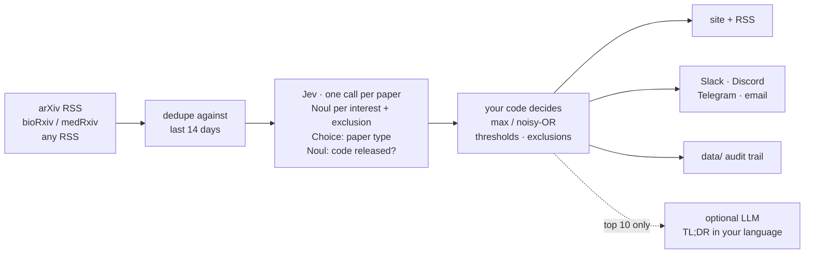

<div align="center">

# ◎ Paper Radar

**Jev reads every new paper on arXiv each morning. You read the few that matter.**

Plain-English interests · calibrated probabilities · about 6 cents a day for *all* of arXiv · fork and go, no server

[Quick start](#quick-start-5-minutes-no-server) · [Try the demo](#try-it-in-10-seconds) · [How it works](#how-it-works) · [繁體中文](README.zh-TW.md)


<sub>Screenshot of the offline demo (fictional papers, mock model). Your page shows real papers scored by Jev.</sub>

</div>

---

arXiv now receives more than 30,000 papers a month ([32,040 in June 2026](https://blog.arxiv.org/2026/07/09/arxiv-now-hosts-over-3-million-articles/)), about 1,500 per weekday announcement. Nobody reads the listing any more. Keyword alerts miss papers that use different words, embedding recommenders quietly drop whatever does not look like your past reading, and running a chat LLM over the whole firehose every day is slow and costs real money.

Paper Radar takes a different route. Every new paper gets **judged** against the interests you wrote in plain English by [Jev](https://typesafe.ai/blog/introducing-system-one-models-and-jev), TypeSafe's System One model. It returns a calibrated probability for each interest instead of generated text, so there is nothing to parse and no invented labels. That is fast and cheap enough to read *everything*, so nothing gets pre-filtered away before it is judged.

|                       | Keyword alerts | Embedding recommenders | LLM digest bots | **Paper Radar** |
|-----------------------|:--:|:--:|:--:|:--:|
| Reads every new paper | ✅ | ✅ | usually only a pre-filtered top-k | ✅ |
| Understands meaning   | ❌ | partly | ✅ | ✅ |
| Explains *why* a paper matched | keyword | ❌ | free text | per-interest probability |
| Thresholds you can tune and check | ❌ | ❌ | ❌ | ✅ `calibrate` |
| Cost to read all of arXiv daily | free | free after setup | higher: you pay for generated text | **≈ $0.06 per day\*** |

<sub>\* Estimate: ~1,500 papers × ~1,000 input tokens × $0.042 per million tokens (output tokens are free). Every run logs the exact tokens and cost in `data/runs.jsonl`. Run `paper-radar check` to estimate your own profile.</sub>

## What you get every morning

- **A web page** on GitHub Pages: must-read and maybe lists, near misses, and what your exclusions filtered out
- **An RSS feed** (`feed.xml`) for any reader, including Zotero (*File → New Feed*), so picks land next to your library
- **Optional digests** on Slack, Discord, Telegram or email
- **Optional one-sentence TL;DRs** in your language, written by any LLM for the top 10 papers only
- **An audit trail**: every decision, probability and model version is committed to `data/`

## Quick start (5 minutes, no server)

1. **Fork this repo.** Then open the **Actions** tab of your fork and click *enable workflows* (GitHub turns them off in new forks).
2. **Describe your interests** in [`radar.toml`](radar.toml): one plain-English statement per interest.
   ```toml
   [[interests]]
   id = "agent_eval"
   label = "Agent evaluation"
   text = "Benchmarks or methods for evaluating LLM agents on multi-step tool-use tasks"
   ```
3. **Add a key** under *Settings → Secrets and variables → Actions*:
   - `TYPESAFE_API_KEY` from [console.typesafe.ai](https://console.typesafe.ai/settings/keys), **or**
   - `OPENROUTER_API_KEY` if you are still on TypeSafe's waitlist. Set `backend = "openrouter"` and `model = "typesafe/jev-1.13"` in `radar.toml`; [OpenRouter serves Jev without a waitlist](https://openrouter.ai/typesafe/jev-1.13).
4. **Turn on Pages:** *Settings → Pages → Source: GitHub Actions*.
5. **Run it:** *Actions → Paper Radar → Run workflow* (type `50` in *limit* for a cheap first test).

After that it runs on weekdays at 02:00 UTC, right after arXiv's daily announcement. Your radar is at `https://<you>.github.io/<repo>/` and the feed at `/feed.xml`.

## Try it in 10 seconds

No key needed. The demo uses fictional papers and a keyword heuristic in place of Jev, so you can see the output before you set anything up.

```bash
pip install git+https://github.com/OWNER/paper-radar
paper-radar demo          # writes ./paper-radar-demo/site/index.html
```

Run it for real from your laptop:

```bash
export TYPESAFE_API_KEY=sk-...
paper-radar check                 # validate radar.toml, lint interests, estimate cost
paper-radar run --limit 50        # judge 50 papers, build ./site
```

## Write interests Jev can answer well

Jev reads your words literally ([Jev 1.13 jaggedness notes](https://docs.typesafe.ai/model-jaggedness/jev-1.13)). `paper-radar check` warns about the common traps.

| Do | Don't |
|----|-------|
| One idea per interest | "RL for robots and also LLM agents" → split into two |
| Put negatives in `[[exclude]]`, phrased positively: *"The main application is medical imaging"* | *"Agents, but not robotics"* |
| Describe the paper: *"Proposes a benchmark for …"* | Ask for counts or dates: *"published after 2024"* |
| Use `weight = 0.5` for nice-to-have topics | Write ten near-duplicate interests |

## How it works



Paper Radar follows TypeSafe's own design patterns:

- **Atomic questions, composed in code.** Each interest is a separate Noul. Relevance is `max(weight × p)` by default, or noisy-OR if you want papers that match several interests to rank higher.
- **Speculative fan-out.** All questions for a paper go in one call; more interests add tokens but almost no latency.
- **Retrieve, then judge.** Jev sees only the title, abstract and categories. Author names and affiliations are left out because they don't bear on the topic.
- **Cascade.** Jev decides what deserves attention across thousands of papers. A generative model, if you turn it on, writes one sentence for the ten that made the cut.
- **Confidence-gated output.** The must-read, maybe and near-miss bands come from thresholds you set and can verify with `calibrate`.

## Calibrate it to *you*

TypeSafe's accuracy and calibration figures are self-reported. Check them on your own judgement instead:

```bash
paper-radar label 2609.01234 yes      # or an arXiv URL
paper-radar label 2609.04321 no
paper-radar calibrate --precision 0.9 --recall 0.9
```

`calibrate` reports the Brier score, the expected calibration error, a precision and recall table, and the `must_read` and `maybe` thresholds that hit your targets. Label about 30 papers, including some from the near-miss list.

## Sources

| type | what | notes |
|------|------|-------|
| `arxiv` | official RSS, any categories, `["*"]` = every archive | new submissions and cross-lists; revisions skipped |
| `biorxiv` / `medrxiv` | public details API | version-1 preprints, optional category filter |
| `rss` | any RSS or Atom feed | journals, lab blogs, `hnrss.org`, newsletters |

Ready-made profiles live in [`profiles/`](profiles): LLM research, neuroscience (bioRxiv), and a whole-arXiv watch for one narrow topic. PRs with your field's profile are very welcome.

## Honest limits

- **Abstracts only.** Jev judges what the abstract says, not the full paper.
- **Jev is new.** It launched in early access in September 2026. Its benchmark numbers are TypeSafe's own and have not been reproduced independently, so pin `model` and use `calibrate`.
- **Text in, choices out.** Jev cannot count, compare dates or write prose, so Paper Radar never asks it to.
- **Adversarial abstracts.** An abstract written to game classifiers can nudge a score. The worst case is one bad pick in your list: nothing is executed on the model's word.
- **Data sharing.** Titles and abstracts (public data) are sent to your chosen provider. Nothing else is.
- Not affiliated with TypeSafe AI.

## Roadmap

- [ ] One-click 👍/👎 on the page via GitHub Issues, harvested into `labels.jsonl`
- [ ] PubMed and Hugging Face Daily Papers sources
- [ ] **Screening mode** for systematic reviews: inclusion and exclusion criteria as Nouls, a PRISMA-style count table, shadow runs next to human reviewers
- [ ] **Lab mode**: one repo, many members, a page per person plus a shared feed
- [ ] Citation-claim checks and missing-methods flags for your must-reads
- [ ] Local open-model backend for fully offline use

## Contributing

Profiles, sources and notifiers are small, self-contained files, which makes them good first PRs. Run `pytest` before opening one. See [CONTRIBUTING.md](CONTRIBUTING.md).

MIT licensed.
