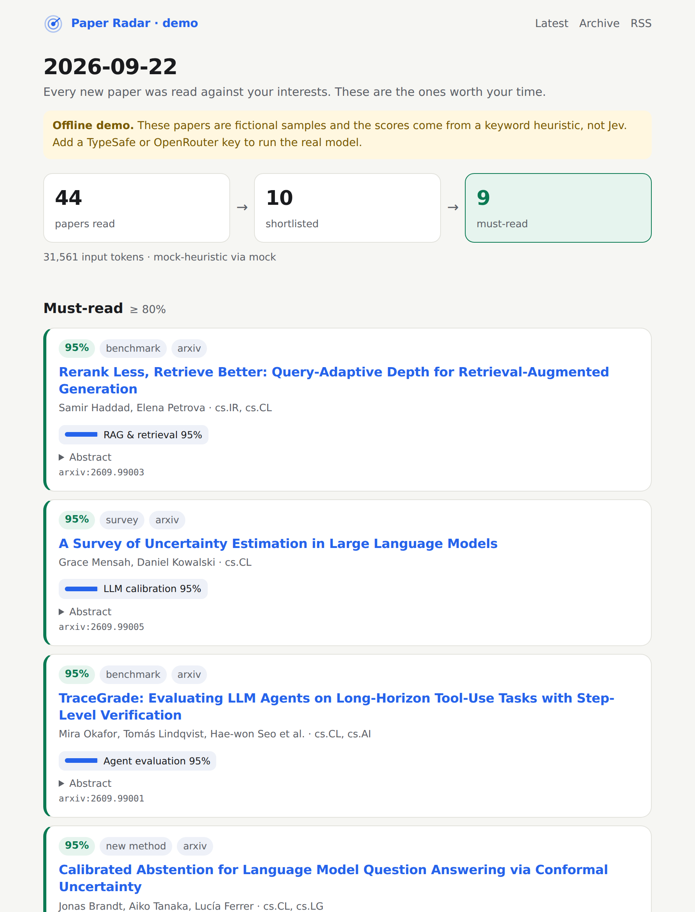
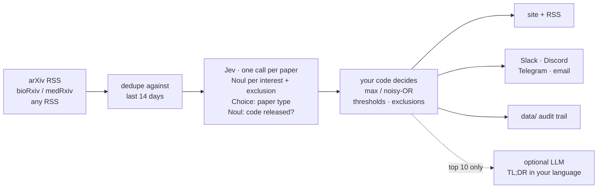

<div align="center">

# ◎ Paper Radar

**Jev reads every new paper on arXiv each morning. You read the few that matter.**

Plain-English interests · calibrated probabilities · about 6 cents a day for *all* of arXiv · fork and go, no server

[Quick start](#quick-start-5-minutes-no-server) · [Try the demo](#try-it-in-10-seconds) · [How it works](#how-it-works) · [Benchmark](#measured-against-real-reviewers-decisions) · [繁體中文](README.zh-TW.md)



<sub>A real run: 50 new arXiv papers judged by Jev in 5 seconds for $0.002. No key? <code>paper-radar demo</code> shows the same page offline.</sub>

</div>

---

arXiv now receives more than 30,000 papers a month ([32,040 in June 2026](https://blog.arxiv.org/2026/07/09/arxiv-now-hosts-over-3-million-articles/)), about 1,500 per weekday announcement. Nobody reads the listing any more. Keyword alerts miss papers that use different words, embedding recommenders quietly drop whatever does not look like your past reading, and running a chat LLM over the whole firehose every day is slow and costs real money.

Most AI tools read a paper and write you a summary. **Paper Radar does not write anything.** It asks [Jev](https://typesafe.ai/blog/introducing-system-one-models-and-jev) — TypeSafe's System One model — one yes/no question per interest and gets a probability back: *introduces an agent benchmark, 0.97*. Your repo's code decides what that means.

Judgement instead of prose is what makes the arithmetic work. There is nothing to parse and no invented labels, and one judgement costs a fraction of a generated sentence — cheap enough to read *all* 1,500 papers rather than a pre-filtered handful, which is where keyword alerts and embedding recommenders lose the paper you actually wanted.

|                       | Keyword alerts | Embedding recommenders | LLM digest bots | **Paper Radar** |
|-----------------------|:--:|:--:|:--:|:--:|
| Reads every new paper | ✅ | ✅ | usually only a pre-filtered top-k | ✅ |
| Understands meaning   | ❌ | partly | ✅ | ✅ |
| Explains *why* a paper matched | keyword | ❌ | free text | per-interest probability |
| Thresholds you can tune and check | ❌ | ❌ | ❌ | ✅ `calibrate` |
| Cost to read all of arXiv daily | free | free after setup | higher: you pay for generated text | **≈ $0.06 per day\*** |

<sub>\* Measured, not guessed: a real run on 2026-09-23 read 50 papers in 5 seconds for 46,584 input tokens and $0.0020 (932 tokens per paper, `jev-1.13.0`). All of arXiv, about 1,500 papers per weekday, works out to roughly $0.06 a day. Output tokens are free. Every run logs its own tokens and cost in `data/runs.jsonl`; `paper-radar check` estimates your profile before you spend anything.</sub>

**Checked against real reviewers, not just claimed:** on four Cochrane reviews it had never seen, screening 19,447 records reproduced **96.9% of the studies the reviewers included** while removing 78% of the reading, for $0.60. The predictions that were wrong on the way there are published too — [see the benchmark](#measured-against-real-reviewers-decisions).

## Subscribe to one before you set anything up

Six radars run here every weekday. Take the RSS link for your field — nothing to install, no key, no account:

**https://eliot5566.github.io/JEV-Paper-Radar/public/**

| Feed | What it reads |
|---|---|
| [AI](https://eliot5566.github.io/JEV-Paper-Radar/public/ai/) | cs.AI, cs.CL, cs.LG — the broad one |
| [Agents](https://eliot5566.github.io/JEV-Paper-Radar/public/agents/) | tool-using and web-browsing LLM agents |
| [Efficiency](https://eliot5566.github.io/JEV-Paper-Radar/public/efficiency/) | faster, smaller, cheaper inference |
| [Robot learning](https://eliot5566.github.io/JEV-Paper-Radar/public/robotics/) | cs.RO |
| [Neuroscience](https://eliot5566.github.io/JEV-Paper-Radar/public/neuro/) | bioRxiv neuroscience + q-bio.NC |
| [Clinical AI](https://eliot5566.github.io/JEV-Paper-Radar/public/clinical/) | PubMed — models evaluated on patients |

Each is an ordinary config file in [`radars/`](radars). Fork the repo and yours will be narrower, and much more useful.

## What you get every morning

- **A web page** on GitHub Pages: must-read and maybe lists, near misses, and what your exclusions filtered out
- **An RSS feed** (`feed.xml`) for any reader, including Zotero (*File → New Feed*), so picks land next to your library
- **Optional digests** on Slack, Discord, Telegram or email
- **Optional one-sentence TL;DRs** in your language, written by any LLM for the top 10 papers only
- **An audit trail**: every decision, probability and model version is committed to `data/`

## Quick start (5 minutes, no server)

1. **Fork this repo.** Then open the **Actions** tab of your fork and click *enable workflows* (GitHub turns them off in new forks).
2. **Describe your interests** in [`radar.toml`](radar.toml): one plain-English statement per interest.
   ```toml
   [[interests]]
   id = "agent_eval"
   label = "Agent evaluation"
   text = "Benchmarks or methods for evaluating LLM agents on multi-step tool-use tasks"
   ```
3. **Add a key** under *Settings → Secrets and variables → Actions*:
   - `TYPESAFE_API_KEY` from [console.typesafe.ai](https://console.typesafe.ai/settings/keys), **or**
   - `OPENROUTER_API_KEY` if you are still on TypeSafe's waitlist. Set `backend = "openrouter"` and `model = "typesafe/jev-1.13"` in `radar.toml`; [OpenRouter serves Jev without a waitlist](https://openrouter.ai/typesafe/jev-1.13).
4. **Turn on Pages:** *Settings → Pages → Source: GitHub Actions*.
5. **Run it:** *Actions → Paper Radar → Run workflow* (type `50` in *limit* for a cheap first test).

After that it runs on weekdays at 02:00 UTC, right after arXiv's daily announcement. Your radar is at `https://<you>.github.io/<repo>/` and the feed at `/feed.xml`.

## Try it in 10 seconds

No key needed. The demo uses fictional papers and a keyword heuristic in place of Jev, so you can see the output before you set anything up.

```bash
pip install git+https://github.com/Eliot5566/JEV-Paper-Radar
paper-radar demo          # writes ./paper-radar-demo/site/index.html
```

Run it for real from your laptop:

```bash
# put your key in a .env file next to radar.toml (it is git-ignored) ...
echo "TYPESAFE_API_KEY=your-key-here" > .env
# ... or export it in your shell instead
paper-radar check                 # validate radar.toml, lint interests, estimate cost
paper-radar run --limit 50        # judge 50 papers, build ./site
```

Real environment variables take precedence over `.env`, so the same commands work unchanged in CI.

## Write interests Jev can answer well

Jev reads your words literally ([Jev 1.13 jaggedness notes](https://docs.typesafe.ai/model-jaggedness/jev-1.13)). `paper-radar check` warns about the common traps.

| Do | Don't |
|----|-------|
| One idea per interest — for *interests*, which combine with `max` | "RL for robots and also LLM agents" → split into two |
| Put negatives in `[[exclude]]`, phrased positively: *"The main application is medical imaging"* | *"Agents, but not robotics"* |
| Describe the paper: *"Proposes a benchmark for …"* | Ask for counts or dates: *"published after 2024"* |
| Use `weight = 0.5` for nice-to-have topics | Write ten near-duplicate interests |

Measured on one day of 299 papers: the two interests worded as one crisp idea each
("introduces a benchmark or an evaluation method", "makes inference faster or cheaper")
produced 14 confident hits each. Three vaguer ones in the same profile — including
"clearly outperforms previous approaches on a widely used task" — never crossed 0.95 at all.

## How it works



Paper Radar follows TypeSafe's own design patterns:

- **Atomic questions, composed in code.** Each interest is a separate Noul. Relevance is `max(weight × p)` by default, or noisy-OR if you want papers that match several interests to rank higher.
- **Speculative fan-out.** All questions for a paper go in one call; more interests add tokens but almost no latency.
- **Retrieve, then judge.** Jev sees only the title, abstract and categories. Author names and affiliations are left out because they don't bear on the topic.
- **Cascade.** Jev decides what deserves attention across thousands of papers. A generative model, if you turn it on, writes one sentence for the ten that made the cut.
- **Confidence-gated output.** The must-read, maybe and near-miss bands come from thresholds you set and can verify with `calibrate`.

## Teach it what you like, in one click

Every paper on your page carries 👍 / 👎 links. Clicking one opens a pre-filled GitHub issue
titled `radar-label: <paper id> yes`; submitting it is the whole interaction. The next run folds
those issues into `data/labels.jsonl`, closes them, and `calibrate` fits your thresholds to them.

In GitHub Actions the links point at your own repo automatically (`GITHUB_REPOSITORY`), so a fork
needs no configuration. Locally, set `output.feedback_repo = "owner/name"` or run
`paper-radar harvest --repo owner/name`.

## Calibrate it to *you*

TypeSafe's accuracy and calibration figures are self-reported. Check them on your own judgement instead:

```bash
paper-radar label 2609.01234 yes      # or an arXiv URL
paper-radar label 2609.04321 no
paper-radar calibrate --precision 0.9 --recall 0.9
```

`calibrate` reports the Brier score, the expected calibration error, a precision and recall table, and the `must_read` and `maybe` thresholds that hit your targets. Label about 30 papers, including some from the near-miss list.

## Sources

| type | what | notes |
|------|------|-------|
| `arxiv` | official RSS, any categories, `["*"]` = every archive | new submissions and cross-lists; revisions skipped |
| `biorxiv` / `medrxiv` | public details API | version-1 preprints, optional category filter |
| `pubmed` | NCBI E-utilities, any PubMed query | errata and comments skipped; set `NCBI_API_KEY` to go from 3 to 10 req/s |
| `rss` | any RSS or Atom feed | journals, lab blogs, `hnrss.org`, newsletters |

```toml
[[sources]]
type = "pubmed"
query = '"atrial fibrillation"[Title/Abstract] AND "anticoagulant"[Title/Abstract]'
days = 2
email = "you@example.com"   # NCBI asks callers to identify themselves
```

Ready-made profiles live in [`profiles/`](profiles): LLM research, neuroscience (bioRxiv), and a whole-arXiv watch for one narrow topic. PRs with your field's profile are very welcome.

## Screening mode, for systematic reviews

A review's title-and-abstract stage is the same shape as a daily radar pointed at a search strategy, with one difference that changes everything: a record is eligible only if **every** inclusion criterion holds, and one exclusion criterion disqualifies it. So screening is a separate command with its own scoring.

```bash
cp profiles/systematic-review.toml review.toml   # edit the query and the criteria
paper-radar screen -c review.toml --limit 50     # a cheap first pass
paper-radar screen -c review.toml
```

Each criterion is one Noul. Eligibility is the geometric mean of the inclusion criteria, so every criterion's evidence counts rather than only the weakest one — `combine = "min"` restores the strict weakest-link reading. Every record ever screened is kept in full in `data/screening/`, rejects included, because a review has to account for all of them.

> **Writing criteria for screening is the opposite of writing interests.** A radar combines interests with `max`, so one more interest is one more chance to match. Screening is a conjunction, so **one more criterion is one more chance to veto a record**. Write the fewest criteria that capture eligibility, and keep each one to something an abstract can actually answer. Measuring this is how we found it out: splitting compound criteria into more of them took one benchmark topic from 10.0% work saved to 0.1%.

The output is the count block PRISMA 2020 asks for:

```
  Records identified                        2314
  Duplicate records removed                  118
  Records screened                          2196
  Records marked ineligible by this tool    1643
      by an exclusion criterion              421
      below the eligibility threshold       1222
  Reports sought for retrieval               194
  Needs manual review (no abstract)          359
```

PRISMA 2020 has a box for records "removed before screening" by **automation tool exclusions**, reported separately from human decisions. That box is the only one this tool is entitled to fill in.

### Check it before you trust it

Screen a few hundred records yourself, label them, and make the tool prove itself against your own judgement:

```bash
paper-radar label 42777254 yes
paper-radar screen -c review.toml --report --recall 0.95
```

It fits the threshold to your recall target and reports **WSS** — work saved over sampling, the metric this literature uses — along with the studies that threshold would have cost you, by ID. Read those before deciding anything.

```
  Suggested threshold                0.372
  Recall at that threshold           95.2%
  Workload saved (WSS)               61.4%

  You would read about 848 of 2196 abstracts and miss 1 of 21 eligible studies.
  Missed: pubmed:42771903
```

### Measured against real reviewers' decisions

Twelve Cochrane reviews from the [CLEF eHealth Technology Assisted Reviews 2019](https://github.com/CLEF-TAR/tar) track, whose relevance judgments are made at the **title-and-abstract stage** — the stage this tool works at. Each review's criteria come from its own published selection criteria, quoted verbatim in [`benchmarks/clef_tar_2019/criteria/`](benchmarks/clef_tar_2019/criteria).

Four of them were never looked at while any of this was being built or fixed:

| Held-out review | Records | Eligible | Recall | Work saved | Cost |
|---|--:|--:|--:|--:|--:|
| Antihypertensives: RAS inhibitors vs other classes | 12,319 | 88 | 95.5% | 68.1% | $0.37 |
| Thromboprophylaxis implementation | 3,574 | 11 | 100% | 95.1% | $0.11 |
| Cyclodestructive procedures for glaucoma | 2,456 | 12 | 100% | 95.8% | $0.08 |
| Psychological therapies for depression in COPD | 1,098 | 16 | 100% | 92.5% | $0.03 |

**19,447 records, 127 eligible studies, 96.9% recall, 78.0% pooled work saved, $0.60.**

The eight reviews used during development did far worse — 38–48% pooled, with individual topics between 0.1% and 82%. **Performance is dominated by the review, not by the tool.** The held-out reviews are large and low in prevalence (0.3–1.5% eligible), which is the regime a real search is in; the development set included 146-record topics where 10% of records were eligible and there was little to save. Treat 78% as what a large search looks like, not as a number you can expect.

Three rounds of it, including the predictions that were wrong, are in [`benchmarks/clef_tar_2019/PREREGISTRATION.md`](benchmarks/clef_tar_2019/PREREGISTRATION.md). Rerunning any of it is one command.

### What this is not

- **Not a replacement for a human screener.** Published evaluations of automated screening report a mean recall around 93% and a mean WSS@95 of about 55%, and they consistently conclude that these tools belong alongside human reviewers rather than in place of one. Use it as a second screener, or to prioritise the order a human screens in.
- **The thresholds above are fitted on the same judgments they are scored against.** That is the optimistic case. It says how well the scores *could* separate eligible studies from the rest, not what you get on a review nobody has screened yet.
- **A third of new PubMed records have no abstract at all.** Measured on 40 consecutive records: 13 had a title and nothing else. Those are never auto-excluded — they go to a manual pile — so the workload saving applies to the records that have something to read.
- **Pin the model.** A `model` change mid-review is a protocol deviation. Every screening record stores the model that produced it.
- **Nobody has run this alongside a live review yet.** The benchmark replays decisions that were already made. If you shadow a review in progress, those numbers would be worth a PR more than anything here.

## Honest limits

- **Abstracts only.** Jev judges what the abstract says, not the full paper.
- **Jev is new.** It launched in early access in September 2026. Its benchmark numbers are TypeSafe's own and have not been reproduced independently, so pin `model` and use `calibrate`.
- **Text in, choices out.** Jev cannot count, compare dates or write prose, so Paper Radar never asks it to.
- **Adversarial abstracts.** An abstract written to game classifiers can nudge a score. The worst case is one bad pick in your list: nothing is executed on the model's word.
- **Data sharing.** Titles and abstracts (public data) are sent to your chosen provider. Nothing else is.
- Not affiliated with TypeSafe AI.

## Roadmap

- [x] One-click 👍/👎 on the page via GitHub Issues, harvested into `labels.jsonl`
- [x] A public demo radar so visitors see real output without a key
- [x] PubMed source via NCBI E-utilities
- [x] **Screening mode** for systematic reviews: criteria as Nouls, PRISMA 2020 counts, WSS measured against your own decisions
- [x] Validated against 12 Cochrane reviews' own title/abstract screening decisions
- [ ] Hugging Face Daily Papers source
- [ ] **Lab mode**: one repo, many members, a page per person plus a shared feed
- [ ] Citation-claim checks and missing-methods flags for your must-reads
- [ ] Local open-model backend for fully offline use

## Contributing

Profiles, sources and notifiers are small, self-contained files, which makes them good first PRs. Run `pytest` before opening one. See [CONTRIBUTING.md](CONTRIBUTING.md).

MIT licensed.
